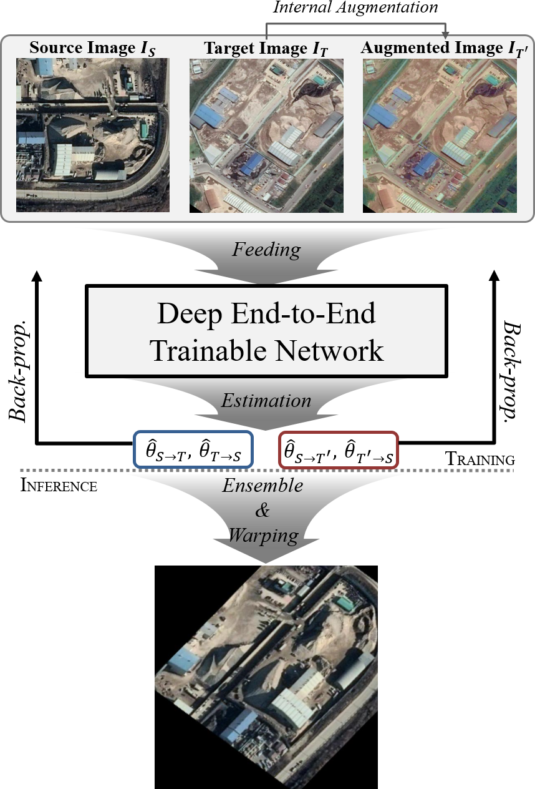

# Deep Aerial Image Matching Implementation

  

## Required package ###
  - Python 3
  - PyTorch, torchvision
  - pretrainedmodels
  - scikit-image, pandas, opencv
  - termcolor, tqdm
  - googledrivedownloader

## Getting started ###
  - demo.py demonstrates the results on the samples of aerial image dataset
  - train.py is the main training script
  - eval_pck.py evaluates on the aerial image dataset

## Trained models ###

Note that, models must be downloaded to the 'trained_models' folder.

| Backbone Network | PCK (tau=0.05) | PCK (tau=0.03) | PCK (tau=0.01) | Download Link                                                |
| ---------------- | ----------------- | ----------------- | ----------------- | ------------------------------------------------------------ |
| ResNet101        | 93.8 %            | 82.5 %            | 35.1 %            | [[here]](https://docs.google.com/uc?id=1lM3PF2yRw1RmYTYUQ24L8rcaX4hRFFfa) |
| ResNeXt101       | 94.6 %            | 85.9 %            | 43.2 %            | [[here]](https://docs.google.com/uc?id=1FjqjbU1CDgoITnAzf6fqvW1tHYS4kHKZ) |
| Densenet169      | 95.6 %            | 88.4 %            | 44.0 %            | [[here]](https://docs.google.com/uc?id=1DsAdFOUpqZDLwONtcTe3NE4ZWtwZquOK) |
| SE-ResNeXt101    | **97.1 %**            | **91.1 %**            | **48.0 %**            | [[here]](https://docs.google.com/uc?id=1vTj9Kk7bQPEOKwtm_TE3gqqcPyuv-x3i) |

