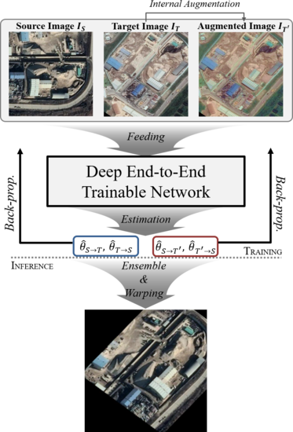

# Deep Aerial Image Matching

<p align="center">
  
</p>

Official PyTorch implementation of:

> **A Two-Stream Symmetric Network with Bidirectional Ensemble for Aerial Image Matching**
> J.-H. Park, W.-J Nam and S.-W Lee
> *Remote Sensing*, 2020, Vol. 12, No. 6, pp. 465
> [[Paper](https://doi.org/10.3390/rs12030465)] [[arXiv](https://arxiv.org/abs/2002.01325)]

## 🎁 Updates

**2025-12-31 (DeepAerialNet v2.0)**

*Feature Extraction*
- **ViT backbone**: Added `vit-l/16` (ViT-Large/16 with DINOv3 sat493m pretrained weights) as a new backbone option

*Feature Correlation*
- **Dual softmax correlation**: Added dual softmax scaling to dot product correlation for improved feature matching (`v2` only)

*Feature Regression*
- **GroupNorm**: Replaced BatchNorm with GroupNorm(g=8) for stable small-batch training (`v2` only)

*Training*
- **Muon optimizer**: Added Muon optimizer for efficient transformer training (`v2` only)

**2025-12-26**
- Migrated pretrained models and datasets to [Hugging Face Hub](https://huggingface.co/jaehyunnn/DeepAerialMatching)
- Replaced `pretrainedmodels` with `timm` library for modern backbone support
- Added `uv` support for fast environment setup

## Installation

```bash
# Quick install with uv (recommended)
./install.sh

# Or manual installation
curl -LsSf https://astral.sh/uv/install.sh | sh
uv venv && source .venv/bin/activate
uv pip install -e ".[download]"
```

## Trained Models

Models are hosted on [Hugging Face Hub](https://huggingface.co/jaehyunnn/DeepAerialMatching).

| Backbone | Version | PCK@0.05 | PCK@0.03 | PCK@0.01 | Download |
|----------|---------|----------|----------|----------|----------|
| ResNet101 | v1 | 93.8% | 82.5% | 35.1% | [checkpoint_resnet101.pt](https://huggingface.co/jaehyunnn/DeepAerialMatching/resolve/main/checkpoints/checkpoint_resnet101.pt) |
| ResNeXt101 | v1 | 94.6% | 85.9% | 43.2% | [checkpoint_resnext101.pt](https://huggingface.co/jaehyunnn/DeepAerialMatching/resolve/main/checkpoints/checkpoint_resnext101.pt) |
| DenseNet169 | v1 | 95.6% | 88.4% | 44.0% | [checkpoint_densenet169.pt](https://huggingface.co/jaehyunnn/DeepAerialMatching/resolve/main/checkpoints/checkpoint_densenet169.pt) |
| SE-ResNeXt101 | v1 | 97.1% | 91.1% | 48.0% | [checkpoint_seresnext101.pt](https://huggingface.co/jaehyunnn/DeepAerialMatching/resolve/main/checkpoints/checkpoint_seresnext101.pt) |
| **ViT-L/16** | v2 | **99.0%** | **96.2%** | **65.7%** | [checkpoint_vit-l16.pt](https://huggingface.co/jaehyunnn/DeepAerialMatching/resolve/main/checkpoints/checkpoint_vit-l16.pt) |

**Download via Python:**
```python
from src.data.download import download_model

# Download specific model
download_model("vit-l/16")        # ViT-L/16 (Best)
download_model("se_resnext101")   # SE-ResNeXt101
download_model("resnet101")       # ResNet101

# Or use huggingface_hub directly
from huggingface_hub import hf_hub_download
hf_hub_download(
    repo_id="jaehyunnn/DeepAerialMatching",
    filename="checkpoints/checkpoint_vit-l16.pt",
    local_dir="."
)
```

**Or via CLI:**
```bash
python src/data/download.py --model vit-l/16       # Download ViT-L/16
python src/data/download.py --model se_resnext101  # Download SE-ResNeXt101
```

## Datasets

Datasets are also hosted on [Hugging Face Hub](https://huggingface.co/jaehyunnn/DeepAerialMatching).

| Dataset | Description | Download |
|---------|-------------|----------|
| evaluation_data | Evaluation benchmark (500 pairs) | [evaluation_data.tar.gz](https://huggingface.co/jaehyunnn/DeepAerialMatching/resolve/main/datasets/evaluation_data.tar.gz) |
| training_data | Training data (18K pairs with CSV) | [training_data.tar.gz](https://huggingface.co/jaehyunnn/DeepAerialMatching/resolve/main/datasets/training_data.tar.gz) |

> **Note:** The ViT-L/16 model was trained with an additional 27K private aerial image pairs on top of the public training dataset.

**Download via Python:**
```python
from src.data.download import download_eval, download_train

download_eval()   # Download evaluation dataset
download_train()  # Download training dataset
```

**Or via CLI:**
```bash
python src/data/download.py --eval   # Evaluation only
python src/data/download.py --train  # Training only
python src/data/download.py          # All datasets
```

## Usage

```bash
# Demo
./scripts/demo.sh
./scripts/demo.sh --backbone resnet101 --model checkpoints/checkpoint_resnet101.pt

# Evaluation
./scripts/eval.sh
./scripts/eval.sh --backbone resnet101 --model checkpoints/checkpoint_resnet101.pt

# Training
./scripts/train.sh
./scripts/train.sh --backbone resnet101 --num-epochs 50
./scripts/train.sh --backbone vit-l/16 --freeze-backbone

# Generate transformation labels
python src/cli/generate_labels.py generate -n 10000 -t affine -o outputs/theta.csv
python src/cli/generate_labels.py generate -n 10000 -t homography -o outputs/homo.csv
```

### Available Options

| Option | Values | Description |
|--------|--------|-------------|
| `--backbone` | `resnet101`, `resnext101`, `se_resnext101`, `densenet169`, `vit-l/16` | Feature extraction backbone |
| `--freeze-backbone` | flag | Freeze backbone weights during training |

### Label Generator

Generate random transformation labels for training data:

```bash
# Generate affine transformations (default: 10000 samples)
python src/cli/generate_labels.py generate -n 10000 -t affine -o outputs/affine.csv

# Generate homography transformations
python src/cli/generate_labels.py generate -n 10000 -t homography -o outputs/homo.csv

# Custom parameters
python src/cli/generate_labels.py generate \
    -n 5000 \
    -t affine \
    --max-translation 0.3 \
    --max-scale 0.4 \
    --max-rotation 0.25 \
    -o outputs/custom.csv

# Add rotation to existing transformations
python src/cli/generate_labels.py add-rotation \
    -i outputs/affine.csv \
    --max-rotation 0.5 \
    -o outputs/rotated.csv

# Extract image pairs from directories
python src/cli/generate_labels.py extract-pairs \
    -s datasets/source \
    -t datasets/target \
    -o outputs/pairs.csv
```

| Option | Default | Description |
|--------|---------|-------------|
| `-n, --num-samples` | 10000 | Number of samples to generate |
| `-t, --type` | affine | Transformation type (`affine` or `homography`) |
| `--max-translation` | 0.5 | Maximum translation ratio |
| `--max-scale` | 0.5 | Maximum scale ratio |
| `--max-rotation` | 0.5 | Maximum rotation (fraction of π) |
| `--max-perspective` | 0.1 | Maximum perspective distortion (homography only) |

### Model Architecture

```
src/models/
├── backbone.py      # FeatureExtraction (CNN/ViT backbones)
├── correlation.py   # FeatureCorrelation
├── layers.py        # FeatureL2Norm, FeatureRegression
├── aerial_net.py    # AerialNetSingleStream, AerialNetTwoStream
└── loss.py          # TransformedGridLoss
```

## Requirements

- Python >= 3.9
- PyTorch >= 2.5
- timm >= 1.0

## Citation

```bibtex
@article{park2020aerial,
  title={A Two-Stream Symmetric Network with Bidirectional Ensemble for Aerial Image Matching},
  author={Park, Jae-Hyun and Nam, Woo-Jeoung and Lee, Seong-Whan},
  journal={Remote Sensing},
  volume={12},
  number={3},
  pages={465},
  year={2020},
  publisher={MDPI}
}
```